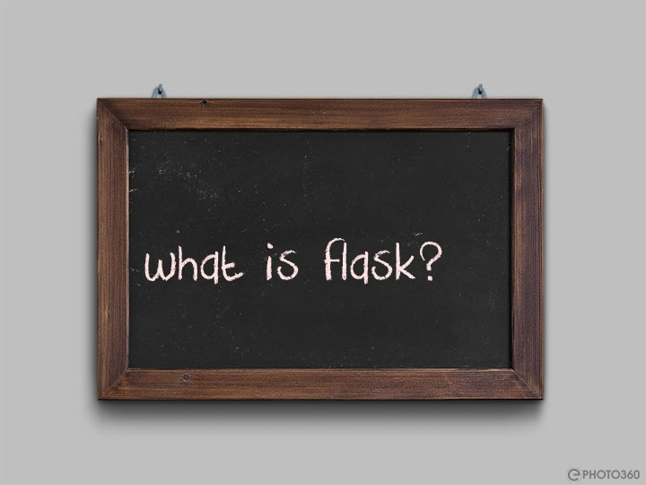

## Getting Started with Flask

- [What is a Flask](#what-is-a-flask)
- [Installing Flask](#installing-flask)
- [Simple APIs with Flask](#simple-apis-with-flask)
    - [Post](#post)
    - [Get](#get)
    - [Put](#put)
    - [Delete](#delete)
    - [Patch](#patch)
    - [Workshop]()

## What is Flask
Python being a very popular language used in many fields including web development, it is also used in many other fields.
[Flask](https://flask.palletsprojects.com/en/2.2.x/) is a micro framework that is used to create web applications. It
depends on the [Jinja2](https://jinja.palletsprojects.com/en/2.10.x/) template engine to render templates and 
[Werkzeug](https://werkzeug.palletsprojects.com/en/1.0.x/) to handle requests making it light and a prominent framework 
for building fast and light APIs.

## Installing Flask
As all safe or legal python packages, to install Flask you need to install the [Python](https://python.org) and use the
[pip](https://pip.pypa.io/en/stable/) command to install Flask.

  ```bash
    pip install flask
   ```
## Simple APIs with Flask
Let's start building a simple API with Flask just very basic.

🤔 What ingredients are needed to build a Flask application and get it running?
- The flask package imported
- A function defining the scope of our application 
- a route decorator for the function path 
- The function `app.run()` is used to start the application 

```python
    from flask import Flask

    app = Flask(__name__)

    @app.route('/')
    def hello_world():
        return 'Hello, It\'s Yokejuste!'
 
    if __name__== '__main__':
      app.run(debug=True)
```
Now we're sure the application is running, and we can test it.

```bash
    curl localhost:5000
    Hello, It's Yokejuste!
```
We can now get things more serious than before. We dive into the next section.
