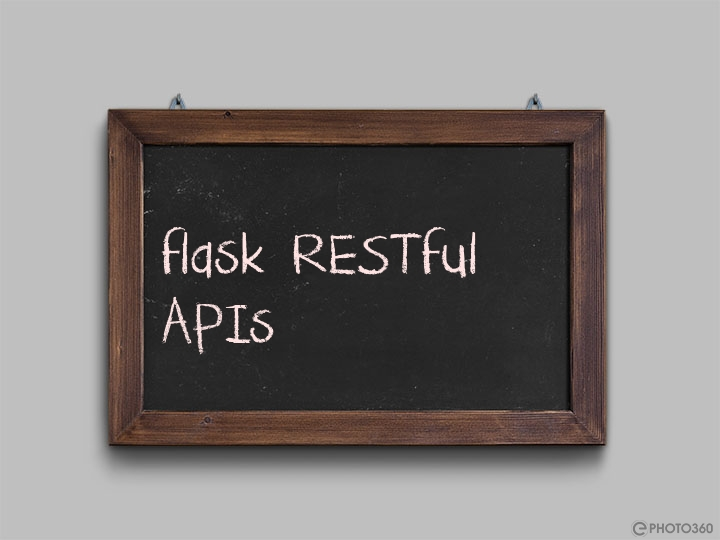

## Powerful APIs with FlaskRESTful

- [Installation](#installation)
- [Simplest REST API structure](#simpliest-rest-api-structure)
- [Resource Routing](#resource-routing)
- [Endpoints](#endpoints)
- [Request Parsing](#request-parsing)
    - [Basic parsing](#basic-parsing)
    - [Multiple Values & Lists](#multiple-values-and-lists)
    - [JSON parsing](#json-parsing)
    - [Error Handling](#error-handling)
- [Response Rendering](#response-rendering)
- [Authentication](#authentication)
- [Cross-Origin Resource Sharing](#cross-origin-resource-sharing)
- [Data Formating](#data-formatting)
- [Output Fields](#output-fields)
- [Customizing the Response](#customizing-the-response)
  - [Basic customization](#basic-customization)
  - [Customizing the Response Headers](#customizing-the-response-headers)
  - [Using default values](#using-default-values)
  - [Complex Structures](#complex-structures)
  - [Nested Fields](#nested-fields)
- [WorkShop]()

FlaskRESTful is a library that helps you to create RESTful APIs with Flask. Moreover, it is a good starting point for any
new developer who is new to Flask. In this part of the tutorial we will be going through the basics of FlaskRESTful.

> 💡It's important to understand that unlike the simple flask apis, flask restful is quite better since it provides
> an Object-Oriented approach to the APIs. 

### Installation
Assuming that your working environment is set up(python, flask,virtual environment), you can install FlaskRESTful by running the following command:

```bash
    pip install FlaskRESTful
```
### Simplest REST API structure

Working with Flask RESTful is quite better than working with Flask. However, it is a good starting point for any new 
developer who is new to Flask. In this part of the tutorial we will be going through the basics of FlaskRESTful.
Below is a snippet to show the simplest GET method in flask RESTful.
    
```python
from flask import Flask
from flask_restful import Resource, Api
app = Flask(__name__)
api = Api(app)

class HelloWorld(Resource):
    def get(self):
        return {'hello': 'world'}
```
Before getting to something complex, let's try to understand the code snippet above.

 - The class we declare above as HelloWorld is *inheriting* from the Resource class is an object. As all objects in OOP as well as 
in life, they all do have attributes and methods, but our focus here is the methods. The **HelloWorld** class can have several methods, 
some of which are: get, put, patch, post.

### Resource Routing
Resources are essential as building blocks of RESTful APIs. Resources are the building blocks of RESTful APIs. They extend themselves
from the Flask pluggable view class and are responsible for handling the requests.
