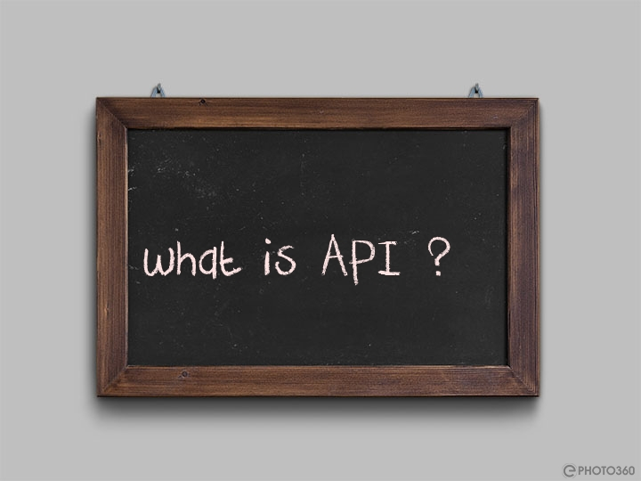

## Introduction

- [What is an API](#what-is-an-api)
- [What is a REST API](#what-is-a-rest-api)
  - [What is REST](#what-is-rest) 
- [Environment setup](#python-environment-setup)
    - [Vitual environment](#virtual-environment)
    - [Flask](#flask)
    - [Flask Restful](#flask-restful)

when it comes to development be it mobile, web, mobile or any other platforms, the APIs are the key to the success of
the application. By using the APIs we can create a robust application that can be used across different platforms. 
Then for you building a different backend for each platform is weird and too stressful. With APIs the game is different.
The API create specific endpoint according to the request and return the response and also on other factors. 

## What is an API



API is a set of rules that defines how an application communicates with another application. Often APIs are considered to
be a set of endpoints that define how to interact with another application. Several companies currently use APIs to build
their own applications. Some of the most popular APIs are: 
- [Stackoverflow](https://api.stackexchange.com/)`public`
- [Github]('https://api.github.com/')`private`
- [Facebook](https://developers.facebook.com/docs/graph-api/overview)`public`.

[Stackoverflow](https://stackoverflow.com) will be our choice for getting how an open API works. I'm using each for
different reasons, like : **No Authentication** needed, broadness of their APIs point, last but not least, it's open and
available.

# What is a REST API
Before understanding what the REST APIs are, let's understand what REST is.

### What is REST
REST, or REpresentational State Transfer, is an architectural style for providing standards between computer systems on
the web, making it easier for systems to communicate with each other. REST-compliant systems, often called RESTful
systems, are characterized by how they are stateless and separate the concerns of client and server.

Conclusively RESTful APIs are stateless and separate the concerns of client and server. Making the **CRUD**(Create Read
Update Delete) operations easier.

## Environment setup
For this small exercise or the ones that will be followed, we will be using [python](https://www.python.org/) >= v3.6 and
some other packages.
### Virtual environment
Assuming you have python installed, you can create a virtual environment.

- Activating the virtual environment
  ```bash
  python3 -m venv venv
  # OR
  virtualenv venv
  ```
  
- Necessary packages installation
  ```bash
  pip install -r requirements.txt
  ```

<p align="left"><a href="../README.md">&laquo; Previous</a></p> <p align="right"><a href="../flask/flask.md#getting_started_with_flask">Next &raquo;</a></p>
<br><br>
